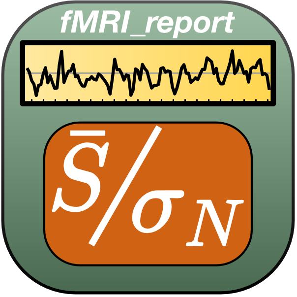
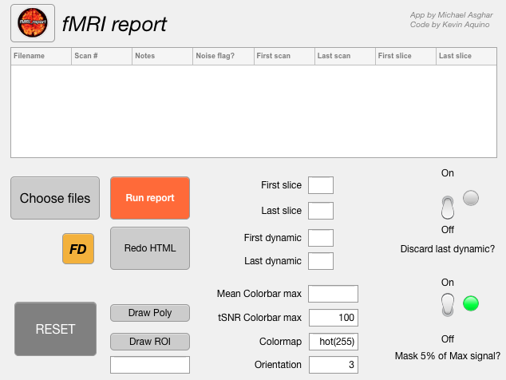

# QA - quality assurance of fMRI data  

<center>

</center>

Github Pages: <https://nottingham-neuroimaging.github.io/qa/>

[](https://www.gnu.org/licenses/gpl-3.0)

# What is this?  
* A MATLAB-based toolbox to allow quick and easy temporal signal-to-noise-ratio analysis of routine brain/fMRI NIFTI data.
* This is important to ascertain the stability of the scanner, and benchmark the quality of your raw data before any further processing.

# MATLAB installation

1. Clone this repository with `git clone https://github.com/nottingham-neuroimaging/qa.git`
2. Add the path to your MATLAB path.
3. There are 2 options for how to run `fMRI_report`:
4. If your **MATLAB** version is **2016a** or later, then in the command window type `fMRI_report_app`
5. If your **MATLAB** version is older than **2016a**, then type `fMRI_report`
6. In both versions, you will select fMRI data using a GUI and generate mean images and tSNR maps. The difference is that `fMRI_report` was written using old-school GUIDElines, whereas the newer `fMRI_report_app` version has the same functionality but is now in the form of a more user-friendly app, especially for debugging/portability etc.

# WIP: Is there a python version? Yes!

* This is tested on macOS Sonoma 14.4.1 Apple M1 Chip, with Python ver 3.11.4 
* Then run:

```
cd fMRI_report_python/
pip install -r requirements.txt
```

* The python version is a work-in-progress **jupyter notebook** that loads in your nifti data (you will need to set paths to your data). Run:

```
cd fMRI_report_python/tutorials/
jupyter notebook qa.ipynb
```

* This code uses a lot of function within the `functions/snr.py` code.
* Example phantom data is in `data/`
* Thanks to [Alex Daniel](https://github.com/UKRIN-MAPS/ukat/tree/master) and his `ukat` repo for help porting this from MATLAB to python.

# Help

If you run into any problems or find any issues with the installation process please raise an [issue](https://github.com/nottingham-neuroimaging/qa/issues
).

## Dependencies  
* For `fMRI_report`, there is a zipped folder that contains the toolbox's dependencies, such as some [mrTools][] and [mgl][] functions. Feel free to ignore if you have already installed these.
* If you are running MATLAB **2016a** or later, you can install the app version by navigating to the app tab in the main MATLAB window (third one along, top left), then clicking **install app**. You can then select the `fMRI_report_app.mlappinstall` file and it should appear in your app toolbar.

<center>

</center>

<center>

</center>

[mrTools]: https://github.com/julienbesle/mrTools
[mgl]: https://github.com/justingardner/mgl
[comment]: # (fMRI_report_app/fMRI_report_image.png)
